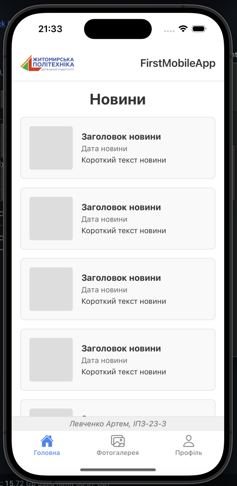
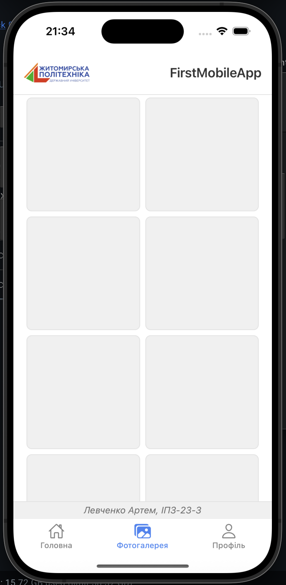
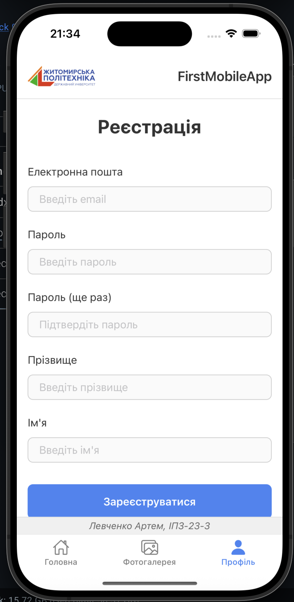

# FirstMobileApp

Простий мобільний додаток на React Native (Expo) з трьома екранами: новини, фотогалерея та реєстрація. Розроблено в рамках лабораторної роботи з дисципліни "Розробка мобільних додатків".

## Зміст

- [Опис](#опис)
- [Встановлення](#встановлення)
- [Запуск](#запуск)
  - [Expo Go (рекомендовано)](#expo-go-рекомендовано)
  - [Android Emulator](#android-emulator)
  - [iOS Simulator](#ios-simulator)
  - [Веб-браузер](#веб-браузер)
- [Скріншоти](#скріншоти)
- [Способи запуску: порівняння](#способи-запуску-порівняння)

## Опис

Додаток складається з трьох екранів:

1. **Головна (Новини)** — список новин у форматі карток із зображенням, заголовком, датою та коротким описом.
2. **Фотогалерея** — сітка фотографій у 2 колонки з можливістю прокрутки.
3. **Профіль (Реєстрація)** — форма реєстрації з полями: email, пароль, підтвердження пароля, прізвище та ім'я. При натисканні кнопки "Зареєструватися" відбувається базова валідація.

Кожен екран містить:

- **Header** з логотипом університету та назвою додатка
- **Footer** з інформацією про автора (ПІБ та група)
- **Bottom Tabs Navigation** для перемикання між екранами

## Встановлення

```bash
# 1. Клонування репозиторію
git clone https://github.com/t-oma/MobileLabsRN2026
cd lab1

# 2. Встановлення залежностей
npm install
```

## Запуск

### Expo Go (рекомендовано)

Найшвидший спосіб запуску на фізичному пристрої без налаштування емуляторів.

```bash
npx expo start
```

1. Встановіть додаток **Expo Go** з App Store (iOS) або Google Play (Android)
2. Відскануйте QR-код, який з'явиться в терміналі
3. Додаток відкриється на вашому телефоні

**Особливості:**

- Не потребує Android Studio / Xcode
- Hot reload працює миттєво
- Підтримує фізичний пристрій через Wi-Fi
- Потребує однакової мережі Wi-Fi для комп'ютера та телефона

### Android Emulator

```bash
npx expo start --android
# або
npm run android
```

**Вимоги:**

- Встановлений Android Studio
- Створений та запущений емулятор Android (Virtual Device)

**Особливості:**

- Повний доступ до функцій Android
- Можливість тестування push-сповіщень
- Вимагає потужний комп'ютер (8+ GB RAM)
- Перший запуск може зайняти кілька хвилин

### iOS Simulator

```bash
npx expo start --ios
# або
npm run ios
```

**Вимоги:**

- macOS
- Встановлений Xcode

**Особливості:**

- Найкраща продуктивність на Mac
- Точна емуляція iOS-пристроїв
- Доступно тільки на macOS
- Xcode займає ~10+ GB дискового простору

### Веб-браузер

```bash
npx expo start --web
# або
npm run web
```

**Особливості:**

- Швидкий запуск для перевірки верстки
- Не потребує мобільного пристрою
- Не всі нативні API доступні (камера, сенсори тощо)
- UI може відрізнятися від мобільної версії

## Скріншоти

### 1. Головна — Новини



Список новин з картками, що містять зображення, заголовок, дату та короткий опис.

### 2. Фотогалерея



Сітка фотографій у дві колонки з можливістю вертикальної прокрутки.

### 3. Профіль — Реєстрація



Форма реєстрації з полями для вводу email, пароля, прізвища та імені.

## Способи запуску: порівняння

| Спосіб               | Призначення        | Швидкість | Нативні API | Фіз. пристрій | Платформа    |
| -------------------- | ------------------ | --------- | ----------- | ------------- | ------------ |
| **Expo Go**          | Швидке тестування  | Швидко    | Обмежено    | Так           | Всі          |
| **Android Emulator** | Тестування Android | Повільно  | Повний      | Ні            | Будь-яка     |
| **iOS Simulator**    | Тестування iOS     | Швидко    | Повний      | Ні            | Тільки macOS |
| **Веб**              | Перевірка UI       | Миттєво   | Немає       | Ні            | Всі          |
