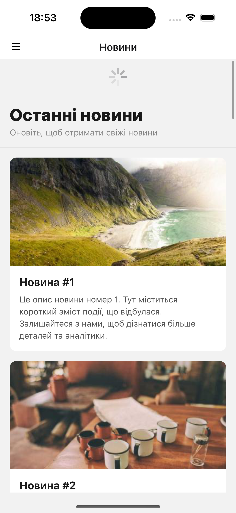
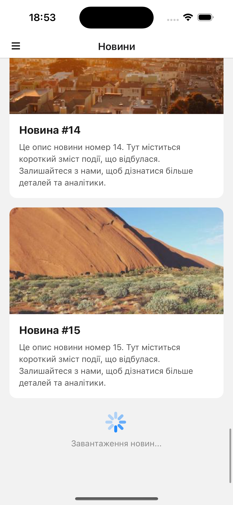
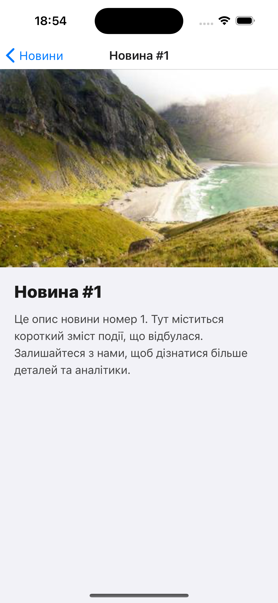
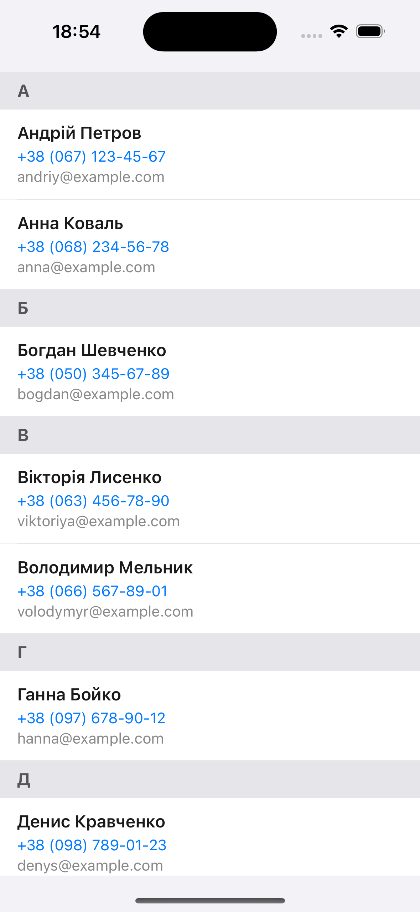

# Лабораторна робота 2: Побудова вкладеної навігації та оптимізація відображення великих списків у React Native із використанням компонентів FlatList та SectionList.

## Зміст

- [Інструкція запуску](#інструкція-запуску)
- [Опис реалізованого функціоналу](#опис-реалізованого-функціоналу)
- [Скріншоти роботи застосунку](#скріншоти-роботи-застосунку)
- [Контрольні запитання (Висновки)](#контрольні-запитання-висновки)
- [Автор](#автор)

## Інструкція запуску

### Передумови

- Встановлений [Node.js](https://nodejs.org/) (рекомендовано LTS версію)
- Встановлений Expo CLI: `npm install -g expo-cli`
- Мобільний пристрій з додатком **Expo Go** (iOS або Android) або емулятор

### Кроки запуску

1. **Клонування репозиторію** (якщо ще не зроблено):

   ```bash
   git clone https://github.com/t-oma/MobileLabsRN2026
   cd lab2
   ```

2. **Встановлення залежностей**:

   ```bash
   npm install
   ```

3. **Запуск проєкту**:

   ```bash
   npx expo start
   ```

   Або скорочений варіант:

   ```bash
   npm start
   ```

4. **Відкриття додатку**:
   - Скануйте QR-код з терміналу за допомогою **Expo Go**
   - Або натисніть `i` для запуску на iOS емуляторі
   - Або натисніть `a` для запуску на Android емуляторі

### Скрипти

- `npm start` — запуск Expo Metro bundler
- `npm run android` — запуск на Android
- `npm run ios` — запуск на iOS
- `npm run web` — запуск у браузері
- `npm run typecheck` — перевірка типів TypeScript

---

## Опис реалізованого функціоналу

### 1. Модель даних

Створено тестові дані для новин (`src/data/newsData.ts`), кожен об'єкт містить:

- `id` — унікальний ідентифікатор
- `title` — заголовок новини
- `description` — опис новини
- `image` — URL зображення

Дані для контактів (`src/data/contactsData.ts`) згруповані за першою літерою ПІБ.

### 2. Список новин (FlatList)

Реалізовано головний екран зі списком новин (`src/screens/NewsListScreen.tsx`) з наступним функціоналом:

- **Pull-to-Refresh**: використано `refreshing` та `onRefresh`, імітація мережевого запиту через `setTimeout`
- **Infinite Scroll**: підвантаження даних при досягненні кінця списку (`onEndReached`, `onEndReachedThreshold={0.5}`)
- **Візуальні компоненти списку**:
  - `ListHeaderComponent` — заголовок "Останні новини"
  - `ListFooterComponent` — індикатор завантаження
  - `ItemSeparatorComponent` — розділювач між елементами
- **Оптимізація**:
  - `initialNumToRender={8}`
  - `maxToRenderPerBatch={5}`
  - `windowSize={11}`

### 3. Екран деталей новини

При натисканні на картку новини відкривається екран деталей (`src/screens/NewsDetailScreen.tsx`) з повною інформацією:

- Зображення
- Заголовок
- Опис

### 4. Екран контактів (SectionList)

Реалізовано екран контактів (`src/screens/ContactsScreen.tsx`) з використанням `SectionList`:

- Контакти згруповані за першою літерою ПІБ (український алфавіт)
- `sections` — масив секцій з заголовками та даними
- `renderItem` — відображення імені, телефону та email
- `renderSectionHeader` — заголовок секції з літерою
- `keyExtractor` — унікальний ключ
- `ItemSeparatorComponent` — розділювач між контактами

### 5. Навігація

Структура навігації:

```
Drawer Navigator
└── Stack Navigator
    ├── Main (список новин)
    └── Details (деталі новини)
Drawer Navigator
└── Contacts (екран контактів)
```

- Перехід між екранами через `navigation.navigate()`
- Передача параметрів (об'єкт `NewsItem`) при переході до деталей
- Динамічний заголовок екрану деталей через `useLayoutEffect` та `navigation.setOptions()`
- Усунення подвійного header'а через `headerShown: false` у Drawer Navigator

### 6. Кастомізація Drawer Menu

Створено власний компонент меню (`src/components/CustomDrawerContent.tsx`), який містить:

- Аватар студента
- ПІБ студента
- Назву групи
- Пункти меню: Новини, Контакти
- Підсвітка активного пункту

---

## Скріншоти роботи застосунку

### Головний екран (список новин)


### Pull-to-Refresh



### Infinite Scroll (підвантаження)



### Екран деталей новини



### Кастомне Drawer Menu


### Екран контактів (SectionList)



---

## Контрольні запитання (Висновки)

### 1. Чим відрізняється FlatList від ScrollView?

**ScrollView** рендерить **всі** дочірні елементи одразу, незалежно від того, чи вони видимі на екрані. Це робить його непридатним для довгих списків, оскільки всі елементи зберігаються в пам'яті, що призводить до просадок продуктивності.

**FlatList** рендерить лише **видимі** елементи та ті, що знаходяться в межах `windowSize`. Він автоматично перевикористовує (recycles) компоненти при скролінгу, що значно економить пам'ять. FlatList підтримує:

- Lazy loading
- Infinite scroll
- Pull-to-refresh

**Висновок**: ScrollView підходить для невеликої кількості контенту, а FlatList — для великих динамічних списків.

### 2. Що таке віртуалізація списків?

**Віртуалізація списків** — це техніка оптимізації, при якій рендеряться лише ті елементи списку, які потрапляють у видиму область екрану (viewport) плюс невеликий буфер (`windowSize`). Елементи, що виходять за межі viewport'а, видаляються з дерева компонентів і перевикористовуються для нових даних при скролінгу.

**Переваги віртуалізації**:

- Зменшення споживання пам'яті — не потрібно тримати всі елементи в RAM
- Підвищення FPS — менше компонентів для перемалювання
- Швидкий початковий рендеринг — завантажується лише перша порція даних

**Параметри FlatList для контролю віртуалізації**:

- `initialNumToRender` — кількість елементів для першого рендеру
- `maxToRenderPerBatch` — кількість елементів за одну ітерацію рендерингу
- `windowSize` — кількість "екранів" даних, що зберігаються в пам'яті

### 3. Як здійснюється передача параметрів між екранами?

У React Navigation передача параметрів відбувається через метод `navigation.navigate()`:

```typescript
// Перехід з параметрами
navigation.navigate("Details", { item: newsItem });
```

Другий аргумент — це об'єкт параметрів, який стає доступним на цільовому екрані через `route.params`:

```typescript
function DetailsScreen({ route, navigation }) {
  const { item } = route.params; // { item: newsItem }
  // Використання параметрів...
}
```

**Типізація в TypeScript**:

```typescript
type RootStackParamList = {
  Main: undefined;
  Details: { item: NewsItem };
};

type Props = StackScreenProps<RootStackParamList, "Details">;
```

**Динамічна зміна заголовка**:

```typescript
useLayoutEffect(() => {
  navigation.setOptions({
    title: route.params.item.title,
  });
}, [navigation, route.params.item.title]);
```

### 4. Що таке вкладена навігація?

**Вкладена навігація** — це комбінування різних типів навігаторів один в одному для створення складних сценаріїв навігації в додатку.

**Приклад з цієї роботи**:

```
Drawer Navigator (бокове меню)
└── Stack Navigator (стек екранів)
    ├── Main (головний екран)
    └── Details (деталі)
```

**Інші поширені комбінації**:

- Drawer + Stack
- Tab + Stack
- Drawer + Tab + Stack

**Переваги**:

- Кожен навігатор відповідає за свою область навігації
- Stack Navigator управляє історією переходів в межах одного розділу
- Drawer Navigator забезпечує доступ до основних розділів з будь-якої точки
- Tab Navigator дозволяє швидко перемикатися між розділами

**Важливо**: `NavigationContainer` має бути один на весь додаток, а навігатори вкладаються один в одного через `component`.

### 5. У яких випадках застосовується SectionList?

**SectionList** застосовується, коли дані потрібно відобразити у вигляді **групованого списку з заголовками секцій**.

**Характерні випадки використання**:

- **Контакти** — групування за першою літерою (A, Б, В...)
- **Налаштування** — групування за категоріями (Загальні, Приватність, Повідомлення...)
- **Календар/Події** — групування за датами (Сьогодні, Завтра, Цей тиждень...)
- **Музика** — групування за виконавцями або альбомами
- **Файлові менеджери** — групування за типами файлів

**Відмінність від FlatList**:

- FlatList — плоский список без групування
- SectionList — список з секціями, кожна з яких має свій заголовок

**Основні пропси SectionList**:

- `sections` — масив об'єктів з `title` та `data`
- `renderSectionHeader` — рендер заголовка секції
- `renderItem` — рендер елемента всередині секції
- `keyExtractor` — унікальний ключ для кожного елемента

---

## Автор

- **Студент**: Левченко Артем
- **Група**: ІПЗ-23-3
