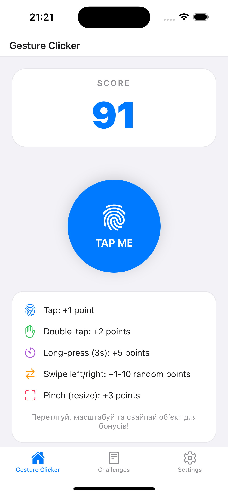
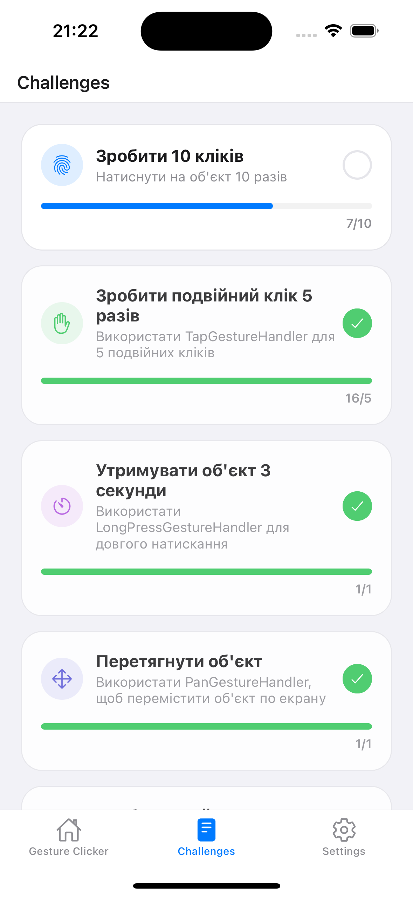
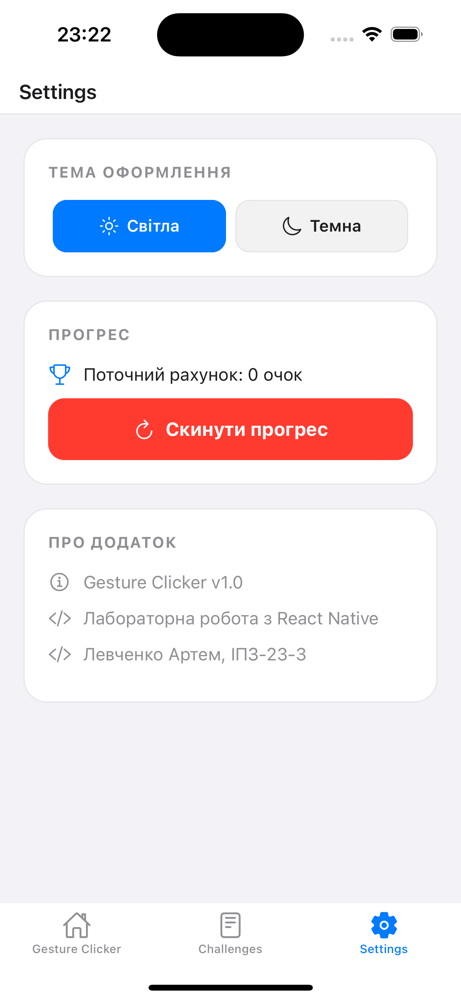
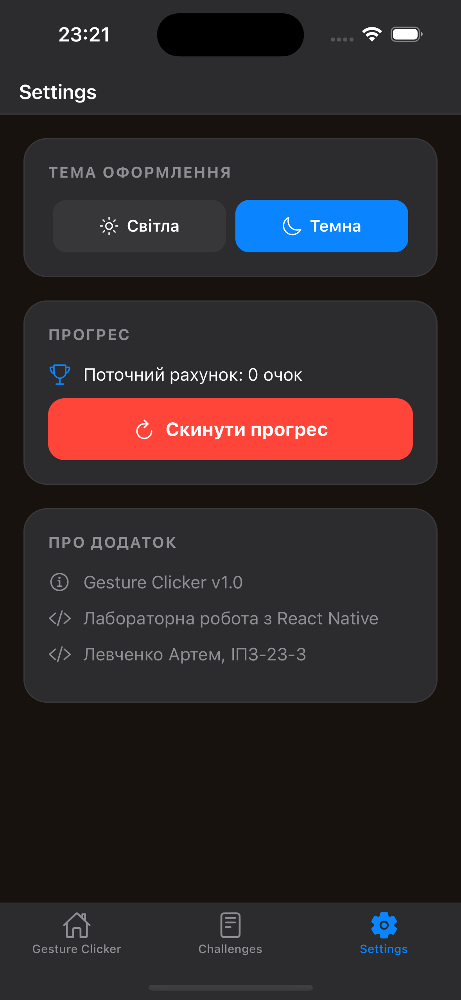

# Gesture Clicker

Мобільний додаток — гра-клікер з використанням жестових взаємодій користувача. Розроблено в рамках лабораторної роботи з React Native.

## Зміст

- [Інструкція запуску](#інструкція-запуску)
- [Опис реалізованого функціоналу](#опис-реалізованого-функціоналу)
- [Скріншоти роботи застосунку](#скріншоти-роботи-застосунку)
- [Висновки](#висновки)
- [Автор](#автор)

## Інструкція запуску

### Передумови

- Встановлений [Node.js](https://nodejs.org/) (рекомендовано LTS версію)
- Встановлений Expo CLI: `npm install -g expo-cli`
- Мобільний пристрій з додатком **Expo Go** (iOS або Android) або емулятор

### Встановлення залежностей

```bash
git clone https://github.com/t-oma/MobileLabsRN2026

cd lab3

pnpm expo install # або: npm expo install
```

### Запуск у режимі розробки

```bash
npx expo start
```

Після запуску відкриється меню в терміналі. Оберіть:

- **i** — запуск на iOS-симуляторі (потрібен macOS + Xcode)
- **a** — запуск на Android-емуляторі
- Скануйте QR-код камерою телефона для запуску через Expo Go

### Збірка продакшн-бандлу

```bash
npx expo export --platform ios
npx expo export --platform android
```

## Опис реалізованого функціоналу

Додаток складається з трьох основних екранів, об'єднаних нижньою навігацією (Bottom Tabs):

### 1. Головний екран (Home)

- **Лічильник очок** — велике анімоване число, що відображає поточний рахунок.
- **Інтерактивний об'єкт «TAP ME»** — кругла кнопка, яка реагує на всі типи жестів.
- **Панель підказок** — опис кожного жесту та кількість очок, що нараховуються.
- **Автоповернення об'єкта** — після перетягування об'єкт плавно повертається в центр екрану.

### 2. Сторінка завдань (Challenges)

- **10 завдань** (8 за умовою лабораторної + 2 власні).
- **Прогрес-бари** — візуальне відображення виконання кожного завдання.
- **Чекбокси** — зелена галочка при виконанні.
- **Прозорість** — виконані завдання стають трохи прозорішими.

### 3. Сторінка налаштувань (Settings)

- **Перемикач теми** — світла / темна.
- **Скидання прогресу** — кнопка з підтвердженням через Alert.
- **Інформація про додаток** — версія, автор, група.

### Жести

| Жест                                 | Опис                                       | Очки               |
| ------------------------------------ | ------------------------------------------ | ------------------ |
| **Одиночне натискання (Tap)**        | Короткий тап по об'єкту                    | +1                 |
| **Подвійне натискання (Double Tap)** | Два швидкі тапи                            | +2                 |
| **Довге натискання (Long Press)**    | Утримуйте об'єкт 3 секунди                 | +5                 |
| **Свайп вправо (Fling Right)**       | Швидкий свайп об'єкта вправо               | +1..10 (випадково) |
| **Свайп вліво (Fling Left)**         | Швидкий свайп об'єкта вліво                | +1..10 (випадково) |
| **Перетягування (Pan)**              | Перемістіть об'єкт по екрану               | —                  |
| **Масштабування (Pinch)**            | Збільшіть або зменшіть об'єкт жестом щипка | +3                 |

> **Примітка:** Об'єкт можна перетягувати та масштабувати одночасно. При скиданні масштабу об'єкт повертається до допустимих меж (0.6× – 2.5×).

### Список завдань

- Зробити 10 кліків
- Зробити подвійний клік 5 разів
- Утримувати об'єкт 3 секунди
- Перетягнути об'єкт
- Зробити свайп вправо
- Зробити свайп вліво
- Змінити розмір об'єкта
- Отримати 100 очок
- **Набрати 20 очок подвійними кліками** (власне завдання)
- **Зробити по 2 свайпи вліво та вправо** (власне завдання)

### Теми оформлення

Додаток підтримує **світлу** та **темну** теми. Перемикання відбувається на екрані налаштувань або автоматично за системними налаштуваннями.

## Скріншоти роботи застосунку









## Висновки

У ході виконання лабораторної роботи було створено повноцінний мобільний додаток — гру-клікер з використанням жестових взаємодій. Основні результати:

1. **Опановано роботу з жестами** у React Native за допомогою бібліотеки `react-native-gesture-handler`. Реалізовано Tap, Double Tap, Long Press, Pan, Fling (swipe) та Pinch жести, які працюють одночасно та коректно обробляються.

2. **Застосовано анімації** через `react-native-reanimated`. Об'єкт плавно переміщується, масштабується та повертається в центр екрану після взаємодії.

3. **Реалізовано систему завдань** з відстеженням прогресу в реальному часі. Завдання автоматично позначаються виконаними при досягненні цільових показників.

4. **Впроваджено темізацію** (світла / темна / системна) з використанням Styled Components та React Context. Всі компоненти адаптуються до обраної теми.

---

## Автор

- **Студент**: Левченко Артем
- **Група**: ІПЗ-23-3
