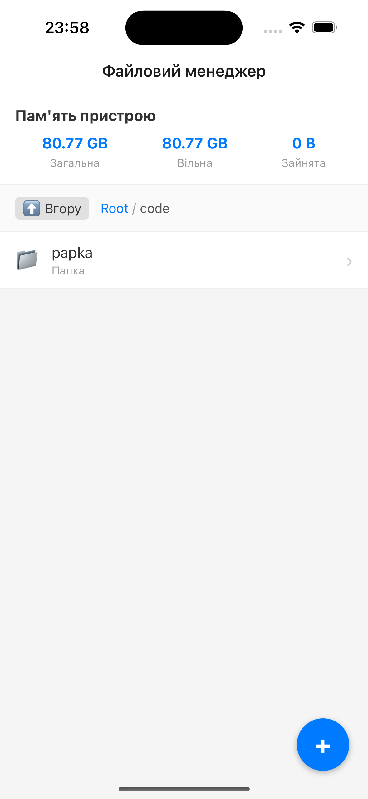
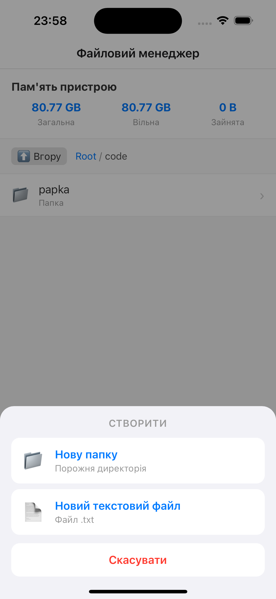
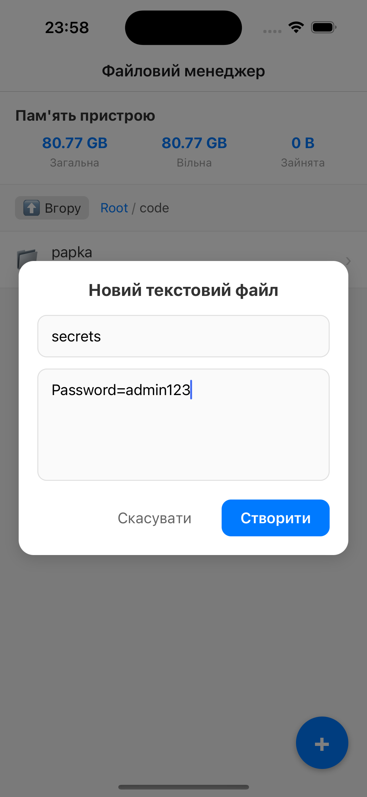
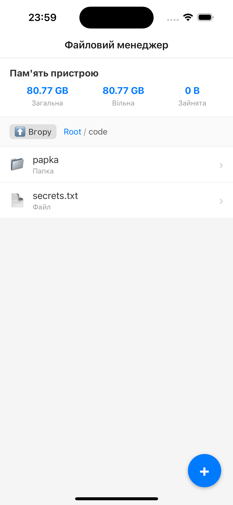
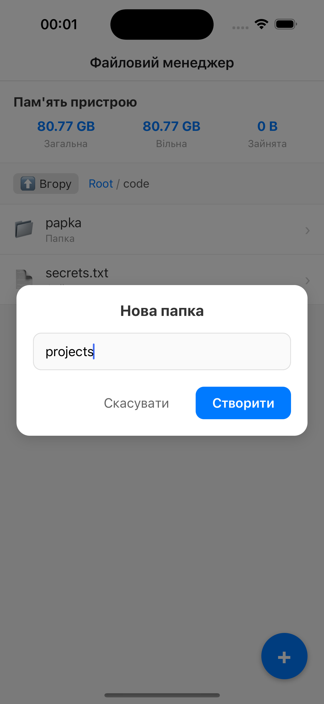
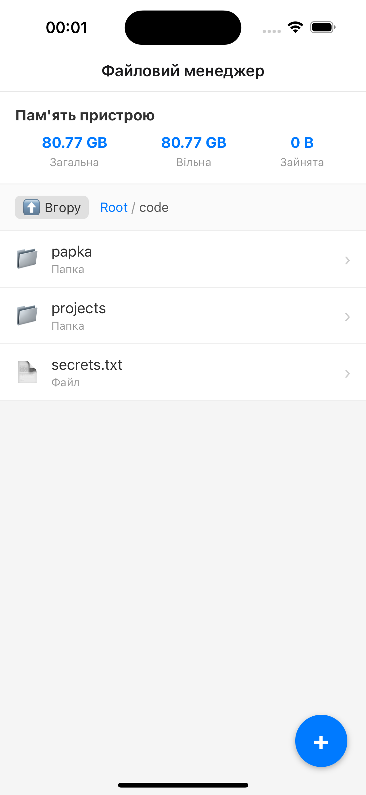
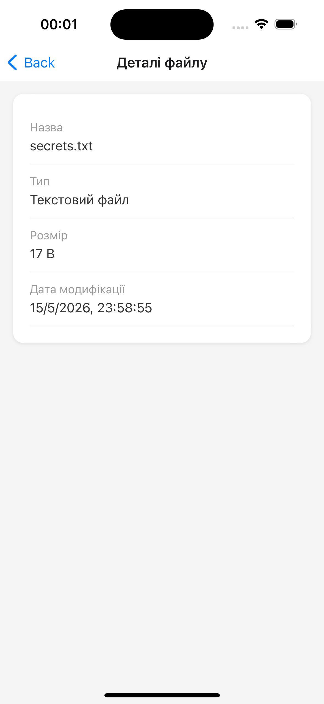
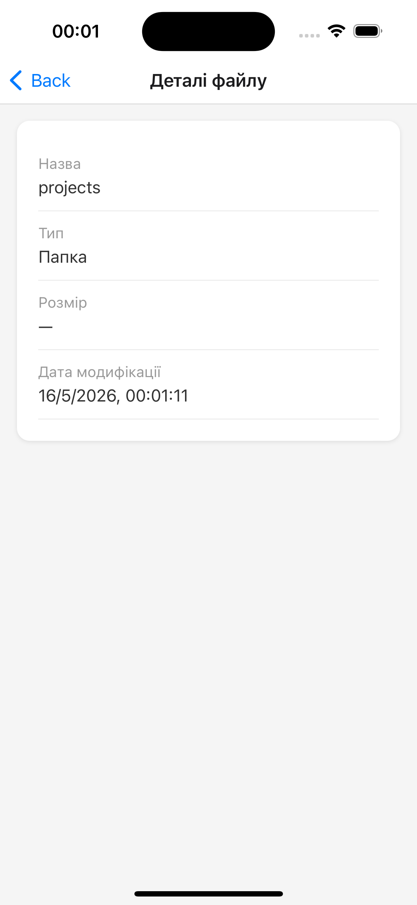
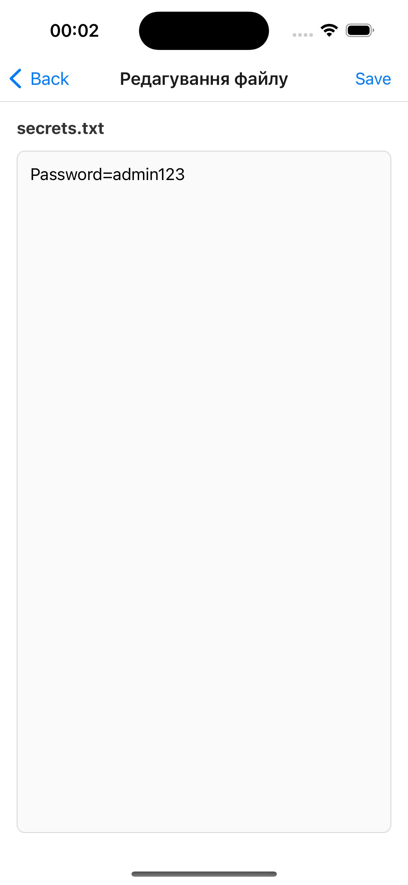
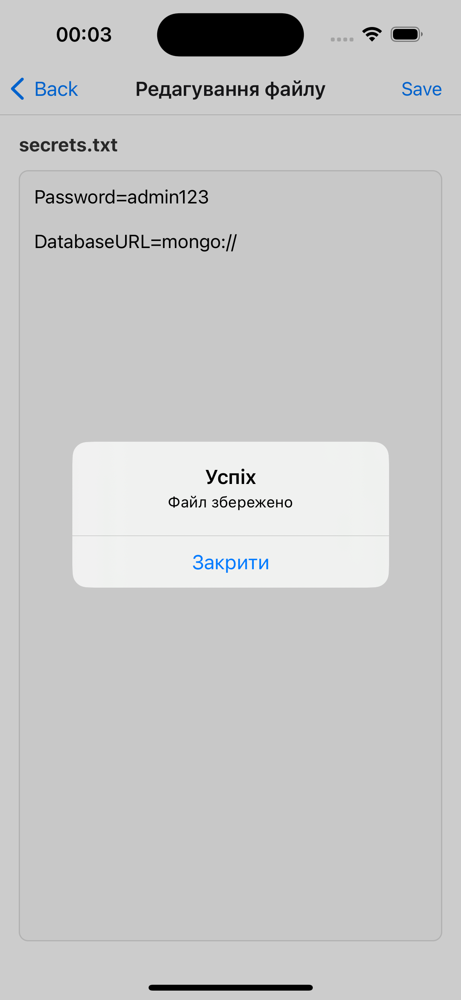

# Файловий менеджер

Мобільний додаток «Файловий менеджер» для роботи з локальною файловою системою в React Native з використанням бібліотеки `expo-file-system`. Розроблено в рамках лабораторної роботи №4 з дисципліни «Розробка мобільних додатків».

## Зміст

- [Інструкція запуску](#інструкція-запуску)
- [Опис реалізованого функціоналу](#опис-реалізованого-функціоналу)
- [Скріншоти роботи застосунку](#скріншоти-роботи-застосунку)
- [Автор](#автор)

## Інструкція запуску

### Передумови

- Встановлений [Node.js](https://nodejs.org/) (рекомендовано LTS версію)
- Мобільний пристрій з додатком **Expo Go** (iOS або Android) або емулятор

### Кроки запуску

1. **Клонування репозиторію** (якщо ще не зроблено):

   ```bash
   git clone https://github.com/t-oma/MobileLabsRN2026
   cd lab4
   ```

2. **Встановлення залежностей**:

   ```bash
   npm expo install
   ```

3. **Запуск проєкту**:

   ```bash
   npx expo start
   ```

   Або скорочений варіант:

   ```bash
   npm start
   ```

4. **Відкриття додатку**:
   - Скануйте QR-код з терміналу за допомогою **Expo Go**
   - Або натисніть `i` для запуску на iOS-симуляторі (потрібен macOS + Xcode)
   - Або натисніть `a` для запуску на Android-емуляторі

### Скрипти

- `npm start` — запуск Expo Metro bundler
- `npm run android` — запуск на Android
- `npm run ios` — запуск на iOS
- `npm run web` — запуск у браузері

## Опис реалізованого функціоналу

### 1. Навігація по файловій системі

- **Головний екран** — відображення вмісту поточної директорії у вигляді списку (📁 папки та 📄 файли)
- **Breadcrumb-навігація** (`Root / папка / підпапка`) з можливістю переходу на будь-який рівень
- **Кнопка «Вгору»** — повернення до батьківської директорії
- **Відкриття папок** — перехід у вкладені директорії одним натисканням
- **Відкриття файлів** — перехід до перегляду/редагування `.txt` файлів

### 2. Створення об'єктів

Двоступеневий процес створення:

1. **Bottom Action Sheet** — натискання на FAB-кнопку `+` відкриває панель знизу з вибором типу:
   - 📁 **Нову папку** — створення порожньої директорії
   - 📄 **Новий текстовий файл** — створення файлу `.txt` з вмістом

2. **Модалка введення** — залежно від вибору відкривається відповідна форма:
   - Для папки: поле «Назва папки»
   - Для файлу: поля «Назва файлу» та багаторядкове поле «Вміст файлу»

### 3. Перегляд та редагування файлів

- **Перегляд** — відкриття `.txt` файлів на окремому екрані
- **Редагування** — зміна вмісту у багаторядковому `TextInput`
- **Збереження** — кнопка «Зберегти» в хедері навігатора (`headerRight`)
- Після збереження з'являється Alert з підтвердженням

### 4. Видалення

- **Довге натискання** на файл/папку відкриває контекстне меню з опціями «Деталі» та «Видалити»
- **Підтвердження** — Alert-dialog з запитом перед видаленням
- Підтримується видалення як файлів, так і папок (з усім вмістом)

### 5. Детальна інформація

Екран деталей відображає атрибути об'єкта:

- **Назва** — ім'я файлу або папки
- **Тип** — Папка / Текстовий файл / Файл (розширення)
- **Розмір** — у зручному форматі (B, KB, MB, GB)
- **Дата модифікації** — локалізований час останніх змін

### 6. Статистика пам'яті

На головному екрані відображається панель з інформацією про диск:

- **Загальний обсяг** — `Paths.totalDiskSpace`
- **Вільний простір** — `Paths.availableDiskSpace`
- **Зайнятий простір** — обчислюється як різниця

## Скріншоти роботи застосунку

### Головний екран (коренева директорія)


Головний екран зі списком файлів та папок, breadcrumb `Root`, панель статистики пам'яті та FAB-кнопка `+`.

### Навігація в підпапку



Перехід у вкладену папку. Breadcrumb оновлюється до `Root / Новая папка`.

### Вибір типу створення (Bottom Action Sheet)



Bottom sheet з'являється після натискання на `+`. Дві опції: створення папки або текстового файлу.

### Створення нового текстового файлу



Модалка з полями для назви файлу та його вмісту.

### Результат створення файлу



Новостворений `.txt` файл у списку.

### Створення нової папки



Модалка з полем для введення назви нової папки.

### Результат створення папки



Новостворена папка з'являється у списку.

### Деталі файлу



Екран деталей `.txt` файлу з назвою, типом, розміром та датою модифікації.

### Деталі папки



Екран деталей папки (розмір не відображається для директорій).

### Редагування файлу



Екран редагування з багаторядковим текстовим полем та кнопкою «Зберегти» в хедері.

### Збереження відредагованого файлу



Alert з підтвердженням успішного збереження файлу.

## Автор

- **Студент**: Левченко Артем
- **Група**: ІПЗ-23-3
