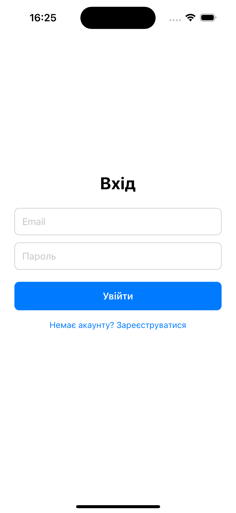
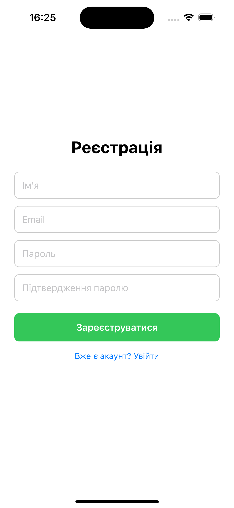
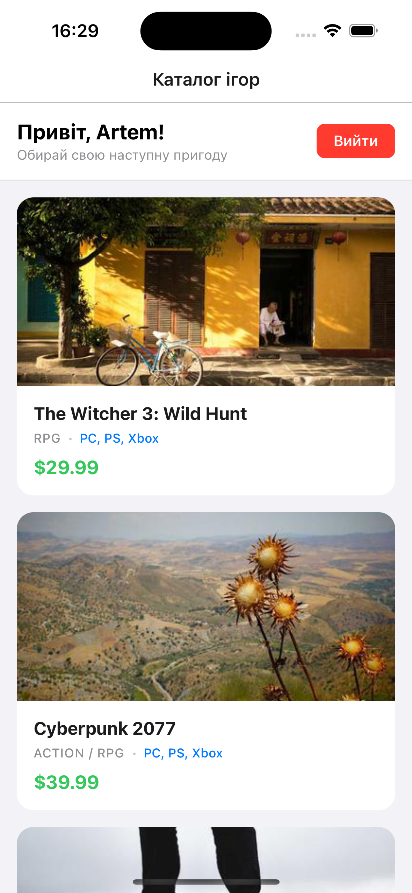
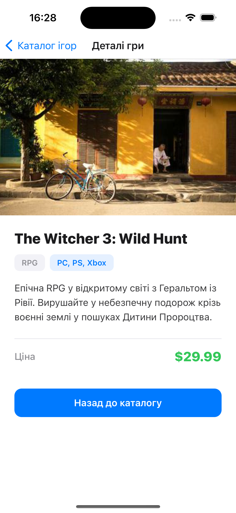
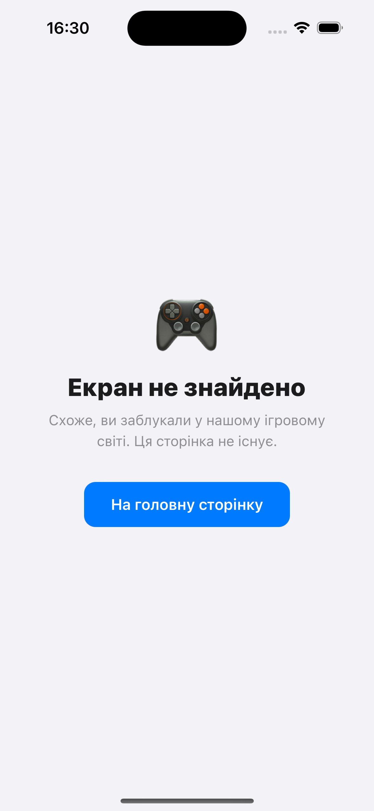

# Лабораторна робота №5

Побудова навігації у React Native із використанням бібліотеки Expo Router

## Зміст

- [Інструкція запуску](#інструкція-запуску)
- [Опис реалізованого функціоналу](#опис-реалізованого-функціоналу)
- [Скріншоти роботи застосунку](#скріншоти-роботи-застосунку)
- [Контрольні запитання](#контрольні-запитання)
  - [1. Перенаправлення неавторизованого користувача](#1-яким-чином-за-допомогою-expo-router-реалізується-перенаправлення-неавторизованого-користувача)
  - [2. Різниця між `<Link>` та `router.push()`](#2-у-чому-полягає-різниця-між-використанням-компонента-link-та-метода-routerpush)
  - [3. Динамічні маршрути та параметри](#3-як-працюють-динамічні-маршрути-в-expo-router-і-як-отримати-передані-параметри)
  - [4. React Context vs локальний стан](#4-чому-стан-авторизації-доцільно-зберігати-у-глобальному-контексті-react-context-а-не-в-локальному-стані-компонента)
  - [5. Групи маршрутів](#5-для-чого-використовуються-групи-маршрутів-foldername-і-як-вони-впливають-на-url-адресу)
- [Автор](#автор)

## Інструкція запуску

### Передумови

- Встановлений [Node.js](https://nodejs.org/) (рекомендовано LTS версію)
- Мобільний пристрій з додатком **Expo Go** (iOS або Android) або емулятор

### Кроки запуску

1. **Клонування репозиторію** (якщо ще не зроблено):

   ```bash
   git clone https://github.com/t-oma/MobileLabsRN2026
   cd lab5
   ```

2. **Встановлення залежностей**:

   ```bash
   npm expo install
   ```

3. **Запуск проєкту**:

   ```bash
   npx expo start
   ```

   Або скорочений варіант:

   ```bash
   npm start
   ```

4. **Відкриття додатку**:
   - Скануйте QR-код з терміналу за допомогою **Expo Go**
   - Або натисніть `i` для запуску на iOS-симуляторі (потрібен macOS + Xcode)
   - Або натисніть `a` для запуску на Android-емуляторі

## Опис реалізованого функціоналу

### 🔐 Авторизація

Реалізовано глобальний контекст авторизації (`context/AuthContext.tsx`), який зберігає стан користувача in-memory:

- **Реєстрація** — створення нового облікового запису з валідацією email (`@` обов'язковий) та пароля (мінімум 6 символів).
- **Вхід** — перевірка облікових даних серед зареєстрованих користувачів.
- **Вихід** — скидання стану авторизації.

### 🛡️ Захищена навігація

- Публічні екрани розміщено в групі `app/(auth)/` — **Вхід** та **Реєстрація**.
- Захищені екрани розміщено в групі `app/(app)/` — доступні лише для авторизованих користувачів.
- Перенаправлення неавторизованого користувача реалізовано через `<Redirect href="/login" />` у `app/(app)/_layout.tsx`.

### 🎮 Каталог ігор

- Відображення списку ігор за допомогою `FlatList`.
- Кожна картка містить: зображення, назву, жанр, платформу та ціну.
- Натискання на картку переходить на екран деталей через `<Link asChild>`.
- Кнопка **Вийти** у верхній частині екрану.

### 📄 Деталі гри

- Динамічний маршрут `app/(app)/details/[id].tsx`.
- Відображається повна інформація: велике зображення, назва, жанр, платформа, опис та ціна.
- Кнопка повернення до каталогу.

### ❌ Обробка неіснуючих маршрутів

- Файл `app/+not-found.tsx` відображає дружнє повідомлення про помилку 404 з кнопкою повернення на головну.

## Скріншоти роботи застосунку

### Екран входу



### Екран реєстрації



### Головний екран (каталог ігор)



### Деталі гри



### Екран не знайдено (404)



## Контрольні запитання

### 1. Яким чином за допомогою Expo Router реалізується перенаправлення неавторизованого користувача?

Перенаправлення реалізується за допомогою компонента `<Redirect>` з пакету `expo-router`. У файлі захищеного макету (`app/(app)/_layout.tsx`) виконується перевірка стану авторизації (`isAuthenticated`). Якщо користувач не авторизований, компонент повертає `<Redirect href="/login" />`, що автоматично перенаправляє на екран входу без додаткових маніпуляцій з навігацією.

### 2. У чому полягає різниця між використанням компонента `<Link>` та метода `router.push()`?

- **`<Link>`** — декларативний компонент, який використовується в JSX для створення навігаційних посилань (аналог `<a>` у вебі). Зручний для статичних переходів у розмітці, підтримує `asChild` для стилізації дочірніх елементів.
- **`router.push()`** — імперативний метод, який викликається програмно (наприклад, після успішного входу або валідації форми). Дозволяє динамічно керувати навігацією з логіки компонента, передавати параметри та обробляти результат.

### 3. Як працюють динамічні маршрути в Expo Router і як отримати передані параметри?

Динамічні маршрути створюються за допомогою файлів з квадратними дужками в назві, наприклад `app/(app)/details/[id].tsx`. Параметр `id` передається через URL (`/details/1`). Для отримання параметрів у компоненті використовується хук `useLocalSearchParams()`:

```tsx
const { id } = useLocalSearchParams<{ id: string }>();
```

Цей хук повертає об'єкт з усіма параметрами, переданими в поточний маршрут.

### 4. Чому стан авторизації доцільно зберігати у глобальному контексті (React Context), а не в локальному стані компонента?

- **Глобальна доступність** — стан доступний з будь-якого компонента додатку без необхідності прокидання props через усі рівні дерева.
- **Єдине джерело правди** — усі компоненти бачать один і той самий стан `isAuthenticated`, що виключає розсинхронізацію.
- **Захист маршрутів** — макети `_layout.tsx` можуть перевіряти стан без прокидання callbacks або state.
- **Збереження логіки** — функції `login`, `register`, `logout` інкапсульовані в одному місці та легко перевикористовуються.

### 5. Для чого використовуються групи маршрутів (folderName) і як вони впливають на URL-адресу?

Групи маршрутів створюються за допомогою папок з назвами в круглих дужках: `(auth)`, `(app)`. Вони дозволяють:

- **Організовувати структуру** — групувати логічно пов'язані екрани (публічні vs захищені) без дублювання коду.
- **Застосовувати спільні макети** — кожна група може мати власний `_layout.tsx` з унікальною логікою (наприклад, перевірка авторизації).
- **Приховувати сегмент URL** — назва групи в дужках **не включається** в URL-адресу. Наприклад, `app/(auth)/login.tsx` відповідає маршруту `/login`, а не `/(auth)/login`.

---

## Автор

- **Студент**: Левченко Артем
- **Група**: ІПЗ-23-3
